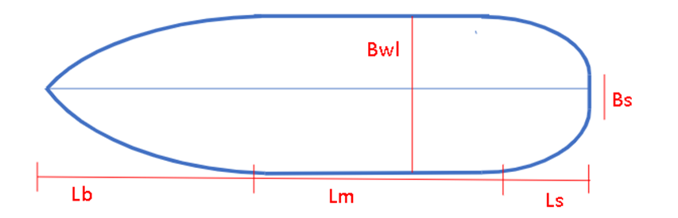
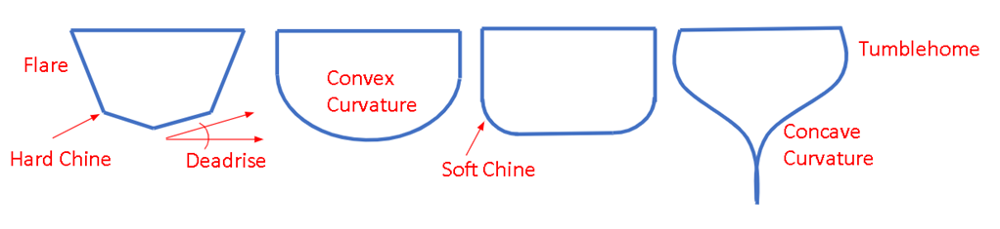
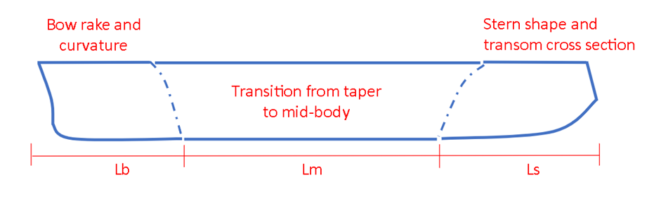
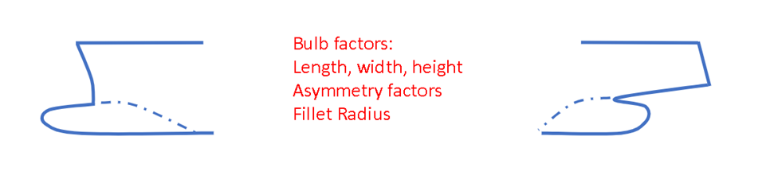
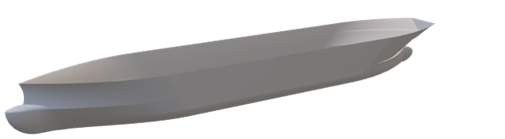
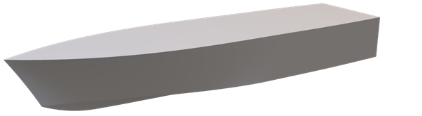
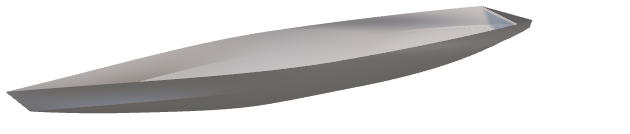
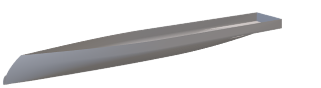
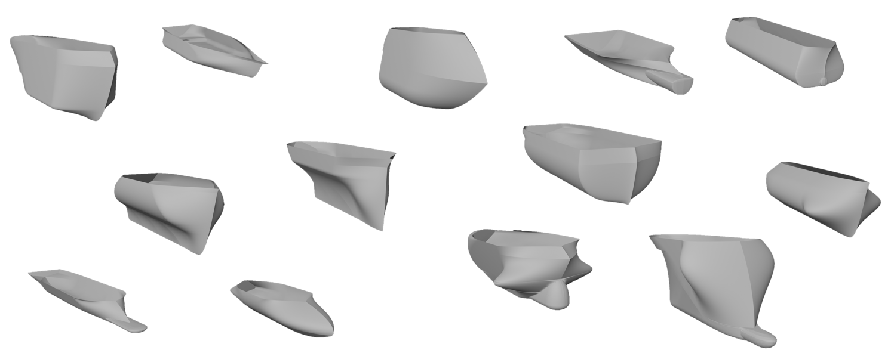

# Ship-D #
Ship-D is a Dataset of 30,000 ship hulls for machine learning applications to ship design. 
Here is a link to the Dataset, Sample Code, and Documentation: https://www.dropbox.com/sh/jg98r425v7ly89l/AAA49uMr7_mhaVmRDrPq0NU_a?dl=0

## Design Representation ## 
The Ship-D Hulls are represented by a parametric design scheme that allows for a large diversity of hull shapes to be constructed. There are 45 parameters that define:

- Principal Dimensions (7 terms)

- Midship shape (4 terms)

- Bow shape (9 terms)
- Stern shape (11 terms)

- Bulb Geometries (14 Terms)

The parameters feed into a set of equations that define the surface of the hull. In addition to 45 parameters, there are also a set of 49 algebraic design constraints that ensure two conditions for the hulls:
1) The hull is watertight
2) The hull is not self-intersecting. 

The algebraic design constraints are much faster at computing hull feasibility than constructing a mesh and checking these conditions by analyzing the mesh. 

## Performance Metrics ##
The dataset containts twelve measures of each hull's geometry. Many are measured at 10 different drafts along the depth of the hull.

1)  Displaced Volume
2)  Surface Area
3)  Waterplane Area
4)  Area Moments of Intertia in Roll Direction ($I_{xx}$)
5)  Area Moments of Intertia in Pitch Direction ($I_{yy}$)
6)  Longitudinal Center of Flotation (Center of Waterplane Area)
7)  Longitudinal Center of Buoyancy (Center of Displaced Volume)
8)  Vertical Center of Buoyancy (Center of Displaced Volume)
9)  Waterline length
10) Height of draft measurement
11) Gaussian Curvature
12) Largest Box that can be vertically lowered into the hull. (Called MaxBox) 

Additionally, there are 32 Wave drag coefficients across 8 speeds and 4 draft marks using Michell integral, 5 images of each hull, and surface meshes

Here are some custom designed hulls using the parameterization:

Container Ship

Planing Hull

Sailing Yacht

DDG-1000 Zumwalt Class (Approximate Reconstruction)

## Dataset ##
The Ship-D Dataset is comprised of three subsets:
1) Hulls using the full breadth of the design parameters. These hulls explore the design space (Constrained Randomized Set 1). 
2) Hulls with a 0 degree deadrise angle (Beta = 0), postive keel radius (Rk >= 0), and with the potential to have bulbs. These hulls are constrained to have features that are more representative of large ships. (Constrained Randomized Set 2)
3) Hulls with out bulbs. Without bulbs and otherwise exploring the full breadth of the design space, these hulls are more representative of smaller boats. (Constrained Randomized Set 3)

Here is an example of the diversity of the hulls seen in the Ship-D dataset. 

Many of these hulls do not look like realistic ships. However, these designs contain random combinations of features that can lead to better performance. The goal of the Ship-D dataset is to create the information to learn how shape features lead to performance in hull design. 

For more information of deep generative artificial intelligence for engineering deisgn, please check out our lab's website:

https://decode.mit.edu/

The DeCoDE Lab creates public datasets, design representations, and deep generative tools.

## Generate a Hull Design ## 

In order to generate a hull, simply import the vector into a numpy array:
'''
import numpy as np
from HullParameterization import Hull_Parameterization as HP

Vectors = np.loadtxt('./Input_Vectors_SampleHulls.csv', delimiter=",", dtype=np.float64)

#Create one hull: 
Hull = HP(Vectors[0])

#Check Constriants:
constraints = Hull.input_Constraints()
cons = constraints > 0
print(sum(cons)) # should be zero

#make the .stl file of the hull:
strpath =  './Sample_Hull_Mesh' 

mesh = Hull.gen_stl(NUM_WL=100, PointsPerWL=800, bit_AddTransom = 1, bit_AddDeckLid = 1, namepath = strpath)

'''

All calculations performed for dataset generation are found in the 'Compute_Dataset_Entirety.ipynb' notebook

## Here is a link to the Ship-D paper:

https://decode.mit.edu/assets/papers/ShipD_Dataset_Bagazinski_and_Ahmed_2023.pdf

## Citation (Chicago)

Bagazinski, Noah J., and Faez Ahmed. "Ship-D: Ship Hull Dataset for Design Optimization using Machine Learning." arXiv preprint arXiv:2305.08279 (2023).

## Bibtex Citation

@article{bagazinski2023ship,

  title={Ship-D: Ship Hull Dataset for Design Optimization using Machine Learning},
  
  author={Bagazinski, Noah J and Ahmed, Faez},
  
  journal={arXiv preprint arXiv:2305.08279},
  
  year={2023}
}
